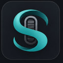

# SilkWheel



**Smooth mouse wheel scrolling for Windows.**

SilkWheel is a lightweight Windows tray utility that turns stepped mouse wheel input into a calmer, smoother, more controllable glide.

[Website](https://silkwheel.raymondstudio.cn/) · [Download](https://github.com/RaymondGuoCGI/SilkWheel/releases/latest) · [Feedback](https://github.com/RaymondGuoCGI/SilkWheel-Feedback/issues) · [中文](#中文)

> Current status: public beta. Free for 21 days; after that, share one real feedback note to keep using the current beta.

## Why SilkWheel

Many Windows apps still treat mouse wheel input as obvious stepped jumps. SilkWheel sits between the wheel and the foreground app, intercepts wheel ticks, and re-emits smaller eased wheel pulses so pages, editors, file lists, and documents feel less harsh.

SilkWheel is designed for people who:

- miss macOS-like inertial scrolling on Windows
- use a regular mouse instead of a precision touchpad
- read long pages, code, docs, PDFs, or file lists every day
- want per-app exclusions when a program should keep native wheel behavior
- prefer a tray app that stays quiet until needed

## Features

- System-wide vertical smooth scrolling for Windows 10/11
- Tuned A/B/native profiles for quick comparison
- Per-app exclusion list
- Tray controls and start-with-Windows option
- Light, gray, dark, and custom themes
- Chinese and English UI
- Local settings file, no telemetry

## Download

Get the latest beta from GitHub Releases:

[Download SilkWheel for Windows](https://github.com/RaymondGuoCGI/SilkWheel/releases/latest)

Windows may show a warning because this early beta is not code-signed yet. This is expected for new unsigned desktop apps. The source is public so you can inspect how the app works before running it.

## How It Works

SilkWheel uses a standard Windows low-level mouse hook (`WH_MOUSE_LL`) to detect wheel events. For non-injected wheel events, it can swallow the original tick and send multiple smaller wheel deltas through `SendInput` using a pulse/ease-out curve.

Important details:

- It only smooths mouse wheel input.
- It ignores injected events to avoid recursion.
- It does not record keyboard input.
- It does not upload app settings or usage data.
- Settings are stored locally in `%AppData%\SilkWheel\settings.json`.

See [Security and Privacy](SECURITY_AND_PRIVACY.md) for more detail.

## Beta Feedback

The current beta is feedback-supported, not payment-gated.

Please tell us:

- Windows version
- mouse model
- apps tested
- selected profile
- whether the scroll tail feels smooth, jumpy, too fast, or too slow

Use one of these channels:

- Website feedback form: https://silkwheel.raymondstudio.cn/#feedback
- GitHub Issues: https://github.com/RaymondGuoCGI/SilkWheel-Feedback/issues
- This repository's issue templates for bugs or scroll-feel feedback

## Build From Source

Requirements:

- Windows 10/11
- .NET 8 SDK

```powershell
dotnet build
dotnet publish -c Release -r win-x64 --self-contained true /p:PublishSingleFile=true /p:IncludeNativeLibrariesForSelfExtract=true
```

Published files are generated under:

```text
bin\Release\net8.0-windows\win-x64\publish
```

## Optional Support

Optional support is welcome, but it is separate from beta access and never required.

- PayPal: https://paypal.me/raymondguocgi
- Quick support: [$5](https://paypal.me/raymondguocgi/5USD) / [$10](https://paypal.me/raymondguocgi/10USD) / [$20](https://paypal.me/raymondguocgi/20USD) / [As you like](https://paypal.me/raymondguocgi)

---

## 中文

SilkWheel 是一款 Windows 托盘工具，用来把生硬的一格一格鼠标滚轮输入，变成更自然、更稳定、更可控的惯性滑动。

官网：[https://silkwheel.raymondstudio.cn/](https://silkwheel.raymondstudio.cn/)<br>
下载：[GitHub Releases](https://github.com/RaymondGuoCGI/SilkWheel/releases/latest)<br>
反馈：[SilkWheel Feedback](https://github.com/RaymondGuoCGI/SilkWheel-Feedback/issues)

### 适合谁

- 想让 Windows 普通鼠标滚轮更接近惯性滚动的人
- 长时间浏览网页、文档、代码、文件列表的人
- 希望某些应用保留原生滚轮行为的人
- 想自己比较不同滚动手感方案的人

### 当前 Beta 规则

SilkWheel 目前处于免费公测阶段。你可以免费使用 21 天；到期后，只需要提交一次真实使用反馈，就可以继续使用当前 Beta 版本。

### 隐私和安全

- 使用 `WH_MOUSE_LL` 捕获鼠标滚轮事件
- 使用 `SendInput` 注入平滑滚动事件
- 不记录键盘输入
- 不上传设置或使用数据
- 设置保存在 `%AppData%\SilkWheel\settings.json`

详情见 [Security and Privacy](SECURITY_AND_PRIVACY.md)。

### 支持开发

如果 SilkWheel 改善了你的日常滚动体验，欢迎通过微信自愿支持开发。打赏和 Beta 使用、解锁完全分开，不是强制要求。


